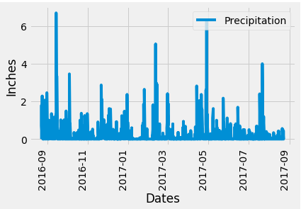
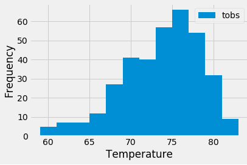
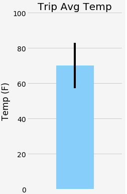

## sqlalchemy-challenge
# A Well-Timed Trip to Hawaii

## Overview

Time to take a trip to Hawaii! To help figure out the best time of year to go weather-wise, climate data gathered over several years is analyzed. Then a Flask API is created to quickly query the data.

Then as a bonus, further analysis of the temperature and precipitation data is performed.

### Files and Folders

* **Jupyter Notebook** (climate_starter.jpynb) - The Jupyter Notebook file that contains the scripts, plot, histogram, and analysis for the main challenge and a bar chart for the **BONUS** section
* [Flask API](app.py) - this file is the script for the Flask API. It contains the various routes to query the data
* [Resources](Resources/) - this folder contains the date source files
    * **hawaii.sqlite** - the sqlite file used to source the Jupyter Notebook and for the analysis
    * [Hawaii Measurements](Resources/hawaii_measurements.csv) - contains the precipitation and temperature data for each station over several years. *Not used as a data source for this challenge; only used for validation.*
    * [Hawaii Stations](Resources/hawaii_stations.csv) - contains the details about each station. *Not used as a data source for this challenge; used only for validation.*

## Analysis

After loading the climate data from the *hawaii.sqlite* file, I needed to see what was actually in there in regards to tables/classes, columns, data types and data itself. Ran the Inspector to see column names and data types in both tables (*measurement* and *station*). Then queried the tables to take a look at the data. 

The analysis was separated out into two sections--one for precipitation and one for stations and temperatures. The precipitation analysis was looking at data for the last year of available dates. Based on the plot created and the summary statistics, even though there are some wet days, for the most part, there are many more days with 0 to less than 0.13 of an inch of precipitation.

Next was to analysis the stations and their temperatures. Found that station WAIHEE 837.5, HI US (USC00519281) was the most active station with temperatures ranging from a minimum 59 degrees F to a maximum of 85 degrees F but averaging 71.7 degrees F. But based on just the last year of available data, the most common temperature range is from about 74 degrees F to about 78 degrees F.

## Climate App

Created a Flask API to utilize queries from the Jupyter Notebook analysis. By using this API, you can see the precipitation data from the last year of available data in a JSON dictionary format. You can also view a list of the stations. Temperature observations from one year prior to the last year for station WAIHEE 837.5, HI US is another option.

There are also two options to view the minimum, average and maximum temperatures for date ranges. The first one lets you, once you click on the link, add your start date in the URL by replacing the **'start'** tag. Enter the date in *yyyy-mm-dd* format. This will return data for all stations from that start date through the end of the dataset, which is 8/23/2017.

The second option, once you click the link, lets you enter your start and end dates by replacing the **'start'** and **'end'** tags in the URL. Enter the dates in *yyyy-mm-dd* format for this as well.

## Bonus Section

I did not have a chance to do the **Temperature Analysis I** section. However, I would've used an unpaired t-test because the two datasets are separate from each other. One set is of June data whereas the other set is of December data.

I did do the **Temperature Analysis II** section, though. I picked my trip dates as 1/30/2017 through 2/6/2017 based on lack of precipitation and desirable temperatures found through the analysis section. Created a bar chart using the prior year's dates for my trip date range and plotted the average temperature.

With all this analysis done, I am ready for that trip to Hawaii!

## Notes

First created the station queries using the station field because that's how they were referred to in the challenge README. But switched that to station name since one of the hints was that some queries would require joins between the two tables and  there was no real purpose for the station table unless to get the station name. So that was kind of unclear in the instructions.

Some of the stations did not have precipitation data for some of the dates in the date range. I filtered those records out of the dataset I used for analysis. They didn't have 0 precipiation, they just had no results collected so I figured that information should be removed. There was temperatuere data for all stations and all dates so nothing was filtered out for the temperature analysis portion.

Not sure about start and end dates for filtering. Unclear what dates last 12 months would include. Did that mean based on full months or a year's worth of dates. I went with a year's worth of dates. 

Wish I had more time to do all of the **Bonus** section because those seemed interesting to figure out how to do.

Had trouble for whatever reason getting the precipitation analysis done in the Jupyer Notebook. Lost track of how many different ways I tried to solve it and get the indexing to work on the date column and still work in the plot. Sometimes it works when running the Jupyter Notebook and sometimes it doesn't. Not sure what the issue is.